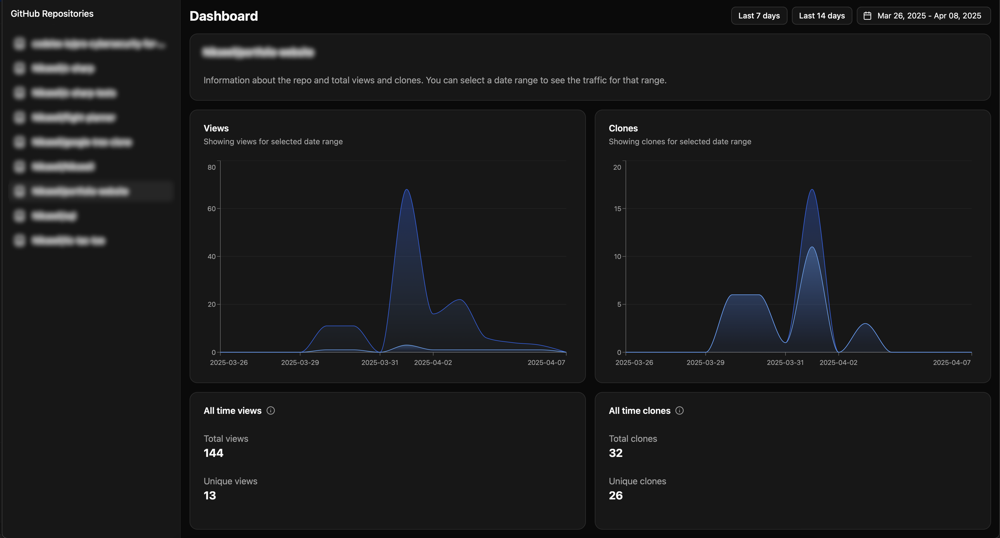

# React + TypeScript + Vite

This template provides a minimal setup to get React working in Vite with HMR and some ESLint rules.

This frontend is designed to work with the [github-traffic-backend](https://github.com/Nikseell/github-traffic-backend), which fetches data from the GitHub API.

## Technologies Used

This project utilizes the following technologies:

- **Framework/Library:** React
- **Language:** TypeScript
- **Build Tool:** Vite
- **Styling:** Tailwind CSS & Shadcn/UI
- **UI Components:** Shadcn/UI & Lucide Icons
